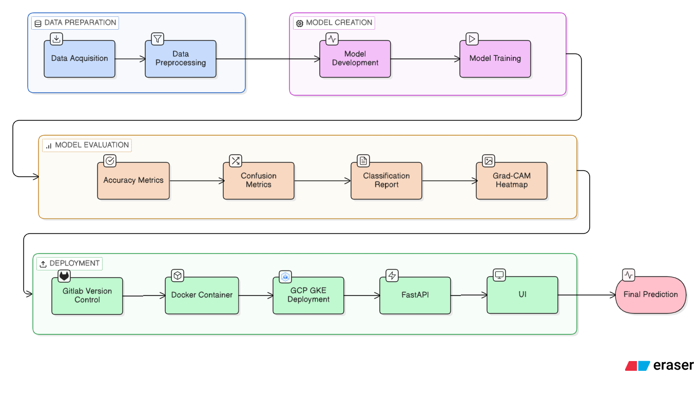

🧠 Brain Breast Tumor AI Detection Tool with Explainable AI
Brain Breast Tumor is a full-stack medical imaging application designed for detecting tumors in MRI and Breast Scan images. It leverages deep learning (CNNs) to provide real-time predictions and GradCAM (Gradient-weighted Class Activation Mapping) visualizations to highlight areas of medical interest.
The project encompasses a modern ML deployment stack, including a FastAPI backend serving the model, Docker containerization, and continuous integration and deployment to Kubernetes using GitLab CI/CD.

```

🏗️ Project Architecture
Frontend: Web UI for uploading scans and viewing inference results/GradCAM heatmaps.
Backend (FastAPI): Asynchronous Python REST API handling model inference and visualization.
AI Core (TensorFlow): Custom CNN implementations dynamically loaded for inference.
Containerization (Docker): Standardized application packaging.
Orchestration (Kubernetes): Deployment manifests for Google Kubernetes Engine (GKE).
CI/CD Pipeline (GitLab): Automated Docker build, push, and Kubernetes deployment.


Architecture Diagram



```

🚀 Getting Started
Prerequisites
Python 3.11+
Docker
Google Cloud SDK (for GKE deployments)
`kubectl`
Local Development Setup
Clone the repository:
```bash
   git clone <your-repo-url>
   cd brain-breast-cancer
   ```
Setup Environment:
```bash
   python -m venv brenv
   source brenv/bin/activate  # Windows: brenv\Scripts\activate
   pip install -r requirements.txt
   pip install -e .
   ```
Run the Application:
Start the FastAPI server directly:
```bash
   python run.py
   ```
The application will be accessible at `http://127.0.0.1:8000`.
Containerized Execution (Docker)
Build the image:
```bash
   docker build -t mlops-app:latest .
   ```
Run the container:
```bash
   docker run -p 8000:8000 mlops-app:latest
   ```
🛠️ Deployment (CI/CD and Kubernetes)
This application is ready to be deployed to Google Kubernetes Engine (GKE) via GitLab CI/CD.
GitLab CI/CD pipeline (`.gitlab-ci.yml`)
Build Stage: Builds the Docker image and pushes it to Google Artifact Registry.
Deploy Stage: Pulls the new image and updates the Kubernetes `Deployment` using GKE credentials.
Manual Kubernetes Deployment
```bash
kubectl apply -f kubernetes-deployment.yaml
# Verifying the deployment
kubectl get pods
kubectl get svc mlops-service
```
🔬 Key Features
Multi-Class Detection: Classifies scans to detect tumors effectively.
GradCAM Visualization: Generates heatmaps to explain AI decision-making (Explainable AI).
Production-Ready: Hosted via Uvicorn, packaged as a Docker container, and deployed seamlessly over Kubernetes.
Scalable Architecture: Decoupled AI microservice design for easy feature expansions.